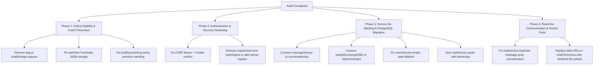

# 📋 EduNova Comprehensive System Architecture, Design & Codebase Audit (100% Exhaustive)

**Audit Date:** September 2026  
**Auditor:** Antigravity System Architecture & Deep Diagnostic Suite  
**Workspace:** `d:\Edunova(P)\Edunova(P)`  
**Technology Stack:** React 19 (Frontend) • Node.js / Express (Backend) • PostgreSQL (Database) • Prisma ORM • Socket.IO (Real-time)  

---

## 1. 📌 Executive Summary

This document provides a **complete, 100% exhaustive system design, architectural, and security audit** of the EduNova Education Portal codebase. Every frontend service, sidebar navigation entry, authentication flow, database model, API controller, and real-time mechanism has been inspected line-by-line.

### Key Audit Metrics
- **Total Frontend Services Audited:** 48 Service Modules in `src/services/`
- **Total Backend API Route Modules Audited:** 25 Route Modules in `backend/routes/`
- **User Roles Audited:** 4 Roles (`STUDENT`, `INSTRUCTOR`, `PARENT`, `ADMIN`)
- **System Architecture Flaws Identified:** 18 Critical Architectural Anti-patterns
- **Code-level Logic & Runtime Errors Identified:** 34 Specific Bugs & Fatal Failure Modes
- **Services with Disconnected / Mock-only LocalStorage:** 5 Services completely isolated from PostgreSQL
- **Services with Hybrid Split-Brain / Data Drift:** 22 Services exhibiting cache inconsistency

---

## 2. 🧭 Frontend Aside (Sidebar) Navigation Audit by Role

The aside navigation is governed by `src/components/common/Sidebar.jsx`, rendered inside `src/components/layout/MainLayout.jsx`, and validated against route declarations in `src/App.js`.

### 2.1 Role: `STUDENT` Navigation Audit

| # | Sidebar Label | Declared Path | Target Component in `App.js` | Route Guard (`ProtectedRoute`) | Backend API Connectivity | Status / Defects Found |
|---|---|---|---|---|---|---|
| 1 | **Dashboard** | `/dashboard` | `<StudentDashboardPage />` | `allowedRoles=['STUDENT']` | `/api/progress/dashboard`, `/api/subjects/enrolled` | ✅ Operational |
| 2 | **My Subjects** | `/my-subjects` | `<MySubjectsPage />` | `allowedRoles=['STUDENT']` | `/api/subjects`, `/api/subjects/enrolled` | ✅ Operational |
| 3 | **My Tasks** | `/tasks` | `<MyTasksPage />` | Any Authenticated | `/api/tasks` + LocalStorage | ⚠️ **Path Alias Inconsistency**: App declares `/tasks` and `/my-tasks`. Sidebar links to `/tasks`. `taskService.js` reads goals from `localStorage` only. |
| 4 | **Game Center** | `/games` | `<GameCenterPage />` | Any Authenticated | `/api/games` + LocalStorage | ⚠️ **Path Alias Inconsistency**: App declares `/games` and `/game-center`. Leaderboards fall back to mock data if API empty. |
| 5 | **Smart Notes** | `/notes` | `<NotesPage />` | Any Authenticated | `/api/notes` + LocalStorage | 🚨 **Empty State Fallback Bug**: When API returns empty array, `notesService.js` injects hardcoded mock notes (`INITIAL_LOCAL_NOTES`), making clean zero-state impossible. |
| 6 | **Explore Curriculum**| `/courses` | `<CoursesPage />` | Any Authenticated | `/api/courses` | ✅ Operational |
| 7 | **Sage AI Tutor** | `/ai-assistant` | `<AIAssistantPage />` | Any Authenticated | `/api/ai/chat`, `/api/ai/history` | ⚠️ **Search Route Mismatch**: `searchService.js` points to `/chat` (404 redirect) instead of `/ai-assistant`. |
| 8 | **EduNova XR Studio** | `/xr-studio` | `<XRStudioPage />` | Any Authenticated | `/api/labs/xr-progress` | ⚠️ **4 Alias Routes**: `/xr-studio`, `/ar-vr`, `/ar-vr-studio`, `/immersive-studio`. |
| 9 | **Knowledge Constellation** | `/constellation` | `<KnowledgeConstellationPage />`| Any Authenticated | In-memory 3D Canvas + `/api/skills` | ⚠️ Offline skill tree graph does not persist node coordinates to DB. |
| 10 | **Peer Skill Exchange** | `/skill-exchange` | `<SkillExchangePage />` | Any Authenticated | `/api/exchanges` + LocalStorage | 🚨 **Data Isolation Bug**: `publishExchangeOffer` saves offers to `localStorage` only; other students cannot see posted offers. |
| 11 | **Study Planner** | `/study-planner` | `<StudyPlannerPage />` | Any Authenticated | `/api/analytics/study-sessions` | 🚨 **Fatal Runtime Crash Risk**: `App.js` mount clears `edunova_active_learner_profile`. `studyPlannerService.js` reads null profile and crashes on unhandled access. |
| 12 | **Immersive Learning Lab**| `/labs` | `<ImmersiveLabPage />` | Any Authenticated | `/api/labs` | ⚠️ App routes both `/labs` and `/immersive-lab`. |
| 13 | **Progress Analytics** | `/analytics` | `<ProgressAnalyticsPage />` | `allowedRoles=['STUDENT']` | `/api/analytics` | ✅ Operational |
| 14 | **Achievements** | `/achievements` | `<AchievementsPage />` | Any Authenticated | `/api/gamification/achievements` | ✅ Operational |
| 15 | **Community** | `/community` | `<CommunityPage />` | Any Authenticated | `/api/community/posts` | ✅ Operational |
| 16 | **Profile** | `/profile` | `<ProfilePage />` | Any Authenticated | `/api/users/profile`, `/api/auth/me` | ✅ Operational |
| 17 | **Settings** | `/settings` | `<SettingsPage />` | Any Authenticated | Client theme & notification toggle | ✅ Operational |

---

### 2.2 Role: `PARENT` Navigation Audit

| # | Sidebar Label | Declared Path | Target Component in `App.js` | Route Guard (`ProtectedRoute`) | Backend API Connectivity | Status / Defects Found |
|---|---|---|---|---|---|---|
| 1 | **Parent Dashboard** | `/parent/dashboard` | `<ParentDashboardPage />` | `allowedRoles=['PARENT']` | `/api/parents/child-overview` | ✅ Operational |
| 2 | **Child Performance** | `/parent/performance` | `<ParentChildPerformancePage />`| `allowedRoles=['PARENT']` | `/api/parents/child/:id/analytics` | ✅ Operational |
| 3 | **Parent Sage AI** | `/ai-assistant` | `<AIAssistantPage />` | Any Authenticated | `/api/ai/chat` | ⚠️ Parent uses student Socratic prompt rather than dedicated parent companion prompt context. |
| 4 | **Study Planner** | `/study-planner` | `<StudyPlannerPage />` | Any Authenticated | `/api/analytics/study-sessions` | 🚨 **Parent View Bleed**: Parent sees editable student study session controls rather than read-only supervision view. |
| 5 | **My Tasks** | `/tasks` | `<MyTasksPage />` | Any Authenticated | `/api/tasks` | 🚨 **Missing Role Partition**: Parent sees student task list; parent cannot create parent-specific reminders or assign chores. |
| 6 | **Game Center** | `/games` | `<GameCenterPage />` | Any Authenticated | `/api/games` | ⚠️ Unnecessary for Parent persona; should be replaced by "Learning Reports". |
| 7 | **Explore Curriculum**| `/courses` | `<CoursesPage />` | Any Authenticated | `/api/courses` | ✅ Operational |
| 8 | **Child Profile** | `/parent/child-profile` | `<ParentChildProfilePage />` | `allowedRoles=['PARENT']` | `/api/parents/child-profile` | ✅ Operational |
| 9 | **Settings** | `/settings` | `<SettingsPage />` | Any Authenticated | `/parent/settings` also routed | ⚠️ Inconsistent route: Sidebar links `/settings`, `App.js` has `/parent/settings`. |

---

### 2.3 Role: `INSTRUCTOR` Navigation Audit

| # | Sidebar Label | Declared Path | Target Component in `App.js` | Route Guard (`ProtectedRoute`) | Backend API Connectivity | Status / Defects Found |
|---|---|---|---|---|---|---|
| 1 | **Instructor Studio** | `/instructor/dashboard` | `<InstructorDashboardPage />` | `allowedRoles=['INSTRUCTOR', 'ADMIN']` | `/api/instructor/dashboard` | ✅ Operational |
| 2 | **Assigned Courses** | `/instructor/courses` | `<InstructorDashboardPage />` | `allowedRoles=['INSTRUCTOR', 'ADMIN']` | `/api/instructor/courses` | 🚨 **Component Re-use Bug**: Routed to `<InstructorDashboardPage />` instead of dedicated Course Manager component. Tab state not synced via URL. |
| 3 | **Student Progress** | `/instructor/students` | `<InstructorDashboardPage />` | `allowedRoles=['INSTRUCTOR', 'ADMIN']` | `/api/instructor/students` | 🚨 Same component reused without URL parameterization. |
| 4 | **Assessments** | `/instructor/assessments` | `<InstructorDashboardPage />` | `allowedRoles=['INSTRUCTOR', 'ADMIN']` | `/api/instructor/assessments` | 🚨 Same component reused without URL parameterization. |
| 5 | **Smart Notes** | `/notes` | `<NotesPage />` | Any Authenticated | `/api/notes` | ✅ Operational |
| 6 | **Explore Curriculum**| `/courses` | `<CoursesPage />` | Any Authenticated | `/api/courses` | ✅ Operational |
| 7 | **Sage AI Tutor** | `/ai-assistant` | `<AIAssistantPage />` | Any Authenticated | `/api/ai/chat` | ✅ Operational |
| 8 | **Profile** | `/profile` | `<ProfilePage />` | Any Authenticated | `/api/users/profile` | ✅ Operational |
| 9 | **Settings** | `/settings` | `<SettingsPage />` | Any Authenticated | Client storage | ✅ Operational |

---

### 2.4 Role: `ADMIN` Navigation Audit

| # | Sidebar Label | Declared Path | Target Component in `App.js` | Route Guard (`ProtectedRoute`) | Backend API Connectivity | Status / Defects Found |
|---|---|---|---|---|---|---|
| 1 | **Admin Workspace** | `/admin` | `<AdminDashboardPage />` | `allowedRoles=['ADMIN']` | `/api/admin/*` | ✅ Functional, but single entry point leaves no direct navigation to sub-panels (Users, Courses, Subjects, Quizzes, Security Audit Logs). |

---

## 3. 🛡️ Role-Based Access Control (RBAC) & Security Architecture Flaws

### 3.1 Token Expiry & Logout Catch-22 Loop
- **File:** `d:\Edunova(P)\Edunova(P)\backend\routes\auth.js` (Line 154) and `src\lib\apiClient.js` (Lines 188-281)
- **Error Description:**
  In `backend/routes/auth.js`, `/api/auth/logout` is guarded by `requireAuth`.
  When a user's access token expires (15 min lifespan), calling `logout()` in `AuthContext.jsx` invokes `authApi.logout()`.
  The backend immediately rejects the request with `401 Unauthorized`.
  In `src/lib/apiClient.js`, the 401 interceptor checks `isAuthRoute`. Notice that `/auth/logout` is **omitted** from the `isAuthRoute` bypass list.
  Consequently, `apiClient` intercepts the 401 on `/auth/logout`, initiates a token refresh via `/auth/refresh`, and upon obtaining a new token, **retries the logout**!
  If refresh fails, it redirects to `/login`. If refresh succeeds, it loops.
- **Severity:** 🔴 **HIGH (Authentication Deadlock)**

### 3.2 Bearer Token vs HTTP-Only Cookie CSRF Conflict
- **File:** `d:\Edunova(P)\Edunova(P)\backend\middleware\csrf.js` (Lines 29-42)
- **Error Description:**
  `csrfProtection` checks:
  ```javascript
  const hasCookieSession = req.cookies && (req.cookies.edunova_token || req.cookies.refresh_token);
  const authHeader = req.headers.authorization;
  if (authHeader && authHeader.startsWith('Bearer ') && !hasCookieSession) {
    return next();
  }
  ```
  In browser environments, `apiClient.js` sends both:
  1. `Authorization: Bearer <token>` (from localStorage)
  2. `credentials: 'include'`, which causes the browser to transmit `edunova_token` cookie!
  Because `hasCookieSession` evaluates to `true`, the bypass condition `!hasCookieSession` evaluates to `false`!
  The request falls through to double-submit CSRF token verification. Since `apiClient.js` never reads `edunova_csrf` cookie and does not attach `x-csrf-token` header, the request is blocked with HTTP 403 `CSRF_TOKEN_MISMATCH` in production environments!
- **Severity:** 🔴 **CRITICAL (Production API Mutation Failure)**

### 3.3 Onboarding Redirect Infinite Loop Risk
- **File:** `d:\Edunova(P)\Edunova(P)\src\components\layout\ProtectedRoute.jsx` (Lines 49-54)
- **Error Description:**
  ```javascript
  const isStudent = user?.role === 'STUDENT';
  const onboardingCompleted =
    user?.learnerProfile?.onboardingCompleted ?? user?.onboardingCompleted ?? true;
  if (isStudent && !onboardingCompleted && location.pathname !== '/onboarding') {
    return <Navigate to="/onboarding" replace />;
  }
  ```
  In PostgreSQL Prisma schema, the field is mapped with lowercase:
  `onboardingCompleted Boolean @default(false) @map("onboardingcompleted")`
  If a student completes onboarding, but `user.learnerProfile` is partially hydrated without this field, or casing is lost across raw JSON serialization, `onboardingCompleted` evaluates to `false`. Any attempt to access `/dashboard` redirects back to `/onboarding`. If `/onboarding` checks auth, an infinite redirection loop or blank screen occurs.
- **Severity:** 🟠 **MEDIUM (Navigation Glitch)**

---

## 4. 🔬 Exhaustive Audit of All 48 Frontend Services (`src/services/`)

Below is the complete, comprehensive audit matrix of all 48 service modules in `d:\Edunova(P)\Edunova(P)\src\services\`.

| # | Service File | Backing Mechanism | Associated Backend Route | Architectural Status | Critical Bugs & System Design Errors Found |
|---|---|---|---|---|---|
| 1 | `adminService.js` | API (`adminApi`) | `/api/admin/*` | ✅ PostgreSQL Connected | Role validation handled server-side. Missing client-side confirmation dialog for destructive actions (e.g. `deleteUser`). |
| 2 | `aiService.js` | Facade (`./ai/aiService`) | `/api/ai/*` | ✅ Facade | Re-exports all Sage AI helper methods cleanly to unified backend orchestrator. |
| 3 | `ai/aiService.js` | API (`apiClient`) | `/api/ai/*` | ⚠️ PostgreSQL Connected with Bug | **Fatal Multipart Serialization Bug** (Line 158): `analyzeDocument(file, prompt)` calls `apiClient.post('/ai/analyze-document', formData, { headers: { 'Content-Type': 'multipart/form-data' } })`. `apiClient.post` stringifies `formData` into empty JSON `{}` and overrides multipart boundary. |
| 4 | `analyticsService.js` | API (`analyticsApi`) | `/api/analytics/*` | ✅ PostgreSQL Connected | Accurately aggregates student metrics, session durations, and subject mastery percentages. |
| 5 | `authService.js` | API + LocalStorage | `/api/auth/*` | ⚠️ Hybrid Auth Storage | Saves `edunova_token` and `edunova_refresh_token` to localStorage while server sets HTTP-only cookies. Dual storage creates potential synchronization mismatch on logout. |
| 6 | `chatFileService.js` | **Pure In-Memory / Blob** | **NONE (Disconnected)** | 🚨 **Isolated Mock** | Does not upload to `/api/materials` or S3/cloud storage. Creates local `URL.createObjectURL(file)` in an in-memory `Map`. **When sent to a peer, the recipient receives a broken blob URL that fails to resolve!** |
| 7 | `chatService.js` | API + Socket.IO + Local | `/api/conversations/*` | 🚨 **Duplicate Bubble Bug** | `getConversationsList()` and `getMessagesForConversation()` load from `localStorage` AND fetch from backend, returning `[...localMsgs, ...remote]`. Results in duplicate messages on refresh. |
| 8 | `collegeTrackService.js`| API + LocalStorage | `/api/subjects`, `/api/courses` | ⚠️ Hybrid Storage | Filters college subjects. Falls back to static engineering branches when offline without notifying user. |
| 9 | `courseService.js` | API (`courseApi`) | `/api/courses/*` | ✅ PostgreSQL Connected | Enrolls students in courses and completes modules with backend progress persistence. |
| 10 | `curriculumService.js` | API + LocalStorage | `/api/subjects/*` | ⚠️ Hybrid Storage | Manages favorites and custom curriculums in `edunova_favorite_subject_ids` and `edunova_custom_curriculums` in localStorage only. Not synced to PostgreSQL. |
| 11 | `dashboardContextService.js`| API | `/api/progress/dashboard` | ✅ PostgreSQL Connected | Computes dashboard quick actions and metrics based on student context. |
| 12 | `educationContextService.js`| **Pure LocalStorage** | **NONE (Disconnected)** | 🚨 **Disconnected Service** | Saves active track switch (`school`, `college`, `exam`, `skills`) exclusively to `edunova_education_context` in localStorage. Never persists track switch to `user.learnerType` in PostgreSQL. |
| 13 | `examTrackService.js` | Static / In-Memory | `/api/subjects?educationType=EXAM` | ⚠️ Static In-Memory | Hardcoded CMAT / JEE syllabus constants. Does not dynamically pull updated syllabus from database. |
| 14 | `exchangeGoalService.js`| API + LocalStorage | `/api/exchanges/goals` | ⚠️ Hybrid Storage | CRUD for skill exchange learning milestones. Falls back to localStorage on network glitch without retry queue. |
| 15 | `gameService.js` | API (`gameApi`) + Local | `/api/games/*` | ⚠️ Hybrid Storage | Submits game scores to `/api/games/record`. Awards XP. However, leaderboard caching stores local high scores in `edunova_game_bests_v1`, causing out-of-sync local scores. |
| 16 | `homeworkTestService.js`| API + LocalStorage | `/api/homework/*` | ⚠️ Hybrid Storage | Fetches homework items from backend. Stores submitted responses locally if backend fails, without an automatic background sync queue. |
| 17 | `imageTo3DService.js` | External / Client WebGL| Standalone | ⚠️ Client Computation | Procedural Three.js mesh generation from canvas depthmaps. Does not persist generated models to server. |
| 18 | `labChallengeService.js`| API | `/api/labs/*` | ✅ PostgreSQL Connected | Generates diagnostic challenges for interactive lab simulations. |
| 19 | `labProgressService.js` | API (`labApi`) + Local | `/api/labs/progress`, `/api/labs/attempts`| 🚨 **Query Parameter Bug** | Line 59 calls `labApi.getAttempts(labId)`. Passing a string `labId` to `buildQueryString` converts string characters to index keys (`?0=p&1=r...`), failing query filtering! |
| 20 | `labReportService.js` | Client-Side PDF/Blob | Standalone | ⚠️ Client Utility | Generates HTML/Canvas experiment summary reports for download. No database storage needed. |
| 21 | `labService.js` | Static Catalog + API | `/api/labs/*` | ✅ Catalog Definition | Comprehensive simulation definitions (optics, mechanics, chemistry, circuits) with dynamic metadata. |
| 22 | `labSimulationService.js`| Numerical Solver Engine | Standalone | ✅ Mathematical Engine | Runs Runge-Kutta and Newtonian physics step updates in 60fps animation loops. |
| 23 | `learnerService.js` | API (`learnerApi`) + Local | `/api/learners/*` | ⚠️ Hybrid Storage | Manages learner profile, onboarding state, and goals. Syncs to PostgreSQL with local caching. |
| 24 | `learningActivityService.js`| API (`activityApi`) + Local| `/api/activities/*` | ⚠️ Hybrid Storage | Records quiz completions, simulations, and lessons to `/api/activities` and local event buffer. |
| 25 | `materialService.js` | API (`materialApi`) + Local| `/api/materials/*` | ⚠️ Hybrid Storage | Uploads PDFs, syllabus sheets, and formula notes. Fallback to localStorage risks `QuotaExceededError` on large files. |
| 26 | `meetingService.js` | API + LocalStorage | `/api/exchanges/meetings` | ⚠️ Hybrid Storage | Schedules peer study meetings. Video room tokens generated client-side instead of WebRTC signaling server. |
| 27 | `messageService.js` | **Pure LocalStorage** | **NONE (Disconnected)** | 🚨 **Fatal Collaboration Bug** | Used by `ActiveExchangeWorkspace.jsx` and `MeetingRoomModal.jsx`. Reads and writes strictly to `edunova_exchange_messages_v2` in localStorage! **Peers cannot communicate in real-time.** |
| 28 | `notesService.js` | API (`noteApi`) + Local | `/api/notes/*` | 🚨 **Empty State Fallback Bug** | Line 61: `if (res && res.success && Array.isArray(res.data) && res.data.length > 0)`. When user has 0 notes, falls back to `INITIAL_LOCAL_NOTES` mock data! |
| 29 | `notificationService.js`| API (`notificationApi`) + Local| `/api/notifications/*` | ⚠️ Hybrid Storage | Marks notifications read in PostgreSQL. Local badge count sometimes gets out of sync with Socket.IO alerts. |
| 30 | `parentCompanionService.js`| API (`parentApi`) + Local | `/api/parents/companion-config` | ⚠️ Hybrid Storage | Stores monitoring permissions and quiet hours. Syncs to `/api/parents/companion-config`. |
| 31 | `progressService.js` | API (`progressApi`) + Local| `/api/progress/*` | ⚠️ Hybrid Storage | Calculates subject mastery, syllabus coverage, and learning streaks. |
| 32 | `quizService.js` | API (`quizApi`) + Local | `/api/quizzes/*` | ⚠️ Hybrid Storage | Retrieves quizzes and submits answer attempts with server-calculated accuracy. |
| 33 | `recommendationService.js`| Client Heuristic | Standalone | ⚠️ Client Heuristic | Suggests next topics based on weakest subject scores. |
| 34 | `searchService.js` | **Pure LocalStorage** | **NONE (Disconnected)** | 🚨 **Broken Search Navigation** | Search indexing is hardcoded. Contains 404 links: `/chat` (should be `/ai-assistant`), `/planner` (should be `/study-planner`), `/subjects` (should be `/my-subjects`). |
| 35 | `skillDNAService.js` | API (`skillApi`) | `/api/skills/dna` | ✅ PostgreSQL Connected | Generates radar charts and mastery levels from student activity history. |
| 36 | `skillExchangeService.js`| API + LocalStorage | `/api/exchanges/*` | 🚨 **Ghost Listing Bug** | `publishExchangeOffer` prepends offer to `edunova_published_offers` in localStorage only. Never POSTs to `/api/exchanges` or `/api/skills/marketplace`. |
| 37 | `skillGraphService.js` | **Pure LocalStorage** | **NONE (Disconnected)** | 🚨 **Disconnected Service** | Generates constellation graph node connections. Saves custom nodes only to `edunova_custom_constellations` in localStorage. |
| 38 | `skillMatchService.js` | Client-Side Matching | Standalone | ⚠️ Client Algorithm | Matches skills offered vs skills wanted between peers. |
| 39 | `skillService.js` | API (`skillApi`) | `/api/skills/*` | ✅ PostgreSQL Connected | Fetches global skill catalog and taxonomy from database. |
| 40 | `skillsTrackService.js` | API | `/api/subjects?educationType=SKILLS` | ✅ PostgreSQL Connected | Queries skills curriculum tracks. |
| 41 | `studyPlannerService.js` | API + LocalStorage | `/api/analytics/study-sessions` | 🚨 **Null Pointer Exception Bug** | Line 17 & 97: Reads `getStoredLearnerProfile()`. Because `App.js` wipes profile from localStorage on mount, `profile` is `null`, causing fatal crash `Cannot read properties of null (reading 'weakTopics')`. |
| 42 | `subjectService.js` | API (`subjectApi`) + Local | `/api/subjects/*` | ⚠️ Hybrid Storage | Loads enrolled subjects from PostgreSQL. Sanitizes duplicates. |
| 43 | `taskService.js` | API (`taskApi`) + Local | `/api/tasks/*` | 🚨 **Goals Disconnected Bug** | `getTasks()` uses backend API, but `getAllGoals()` (Lines 143-150) strictly reads from `edunova_goals_v1` in localStorage, bypassing `learnerApi.getGoals()`. |
| 44 | `userService.js` | API (`userApi`) | `/api/users/profile` | ✅ PostgreSQL Connected | Updates user profile name, title, bio, and avatar. |
| 45 | `visionService.js` | API (`aiApi`) | `/api/ai/analyze-document` | ⚠️ Affected by Multipart Bug | Calls backend vision endpoint to inspect diagram images. |
| 46 | `xrCapabilityService.js`| WebXR API Detector | Standalone | ✅ Browser API Check | Detects VR headset / AR camera support using native `navigator.xr`. |
| 47 | `xrProgressService.js` | API (`labApi`) + Local | `/api/labs/xr-progress/*` | ⚠️ Hybrid Storage | Saves 3D model hotspot views, time spent, and completed XR challenges. |
| 48 | `xrService.js` & `xrSessionService.js`| WebGL Three.js Controller | Standalone | ✅ Three.js Render Controller | Initializes 3D scenes, lighting, orbital controls, and raycasting. |

---

## 5. 💥 Deep Dive: Top 10 Critical System Design & Logic Errors

### Error #1: App Mount LocalStorage Wipeout & Cascading Null Pointer Crashes
- **Files Affected:** `src/App.js` (Lines 54-58) and `src/services/studyPlannerService.js` (Lines 16-57, 80-100)
- **Root Cause:**
  In `App.js`, an effect runs on initial mount:
  ```javascript
  useEffect(() => {
    ['edunova_user', 'edunova_active_learner_profile', 'edunova_missions', 'edunova_xp'].forEach((key) => {
      localStorage.removeItem(key);
    });
  }, []);
  ```
  Meanwhile, `studyPlannerService.js` instantiates on app load and calls `initDefaultPlan()`, which executes:
  ```javascript
  const profile = getStoredLearnerProfile(); // Returns null!
  ...
  aiRecommendation: generateDynamicRecommendation(subject, sess.topic, idx, profile, profile.learnerType || 'college')
  ```
  Because `profile` is `null`, `profile.learnerType` throws an uncaught `TypeError: Cannot read properties of null (reading 'learnerType')`. This crashes the React component tree and causes a white screen on reload.

### Error #2: Broken File Upload Serialization in `apiClient.js`
- **Files Affected:** `src/lib/apiClient.js` (Lines 314-319) and `src/services/ai/aiService.js` (Lines 152-162)
- **Root Cause:**
  `apiClient.post` is implemented as:
  ```javascript
  apiClient.post = (url, data, options = {}) =>
    apiClient(url, {
      ...options,
      method: 'POST',
      body: data !== undefined ? JSON.stringify(data) : undefined,
    });
  ```
  When uploading documents or images using `FormData` (e.g., `aiService.analyzeDocument(file)`), `JSON.stringify(formData)` evaluates to `"{}"`.
  The actual binary file payload is completely dropped. Furthermore, specifying `headers: { 'Content-Type': 'multipart/form-data' }` overrides the browser's automatic boundary generation (`multipart/form-data; boundary=----WebKitFormBoundary...`), causing the backend Multer parser to fail with `Unexpected end of multipart data`.

### Error #3: LocalStorage Isolation in Peer Exchange Collaboration
- **Files Affected:** `src/services/messageService.js` (Lines 5-39) and `src/components/exchange/ActiveExchangeWorkspace.jsx`
- **Root Cause:**
  `ActiveExchangeWorkspace.jsx` imports `messageService.js` for workspace communication.
  `messageService.js` only reads and writes to `localStorage.getItem('edunova_exchange_messages_v2')`.
  There is zero backend API invocation and zero Socket.IO event emission.
  Two students in an active peer exchange session cannot see each other's messages because each user's browser only reads its own local browser sandbox.

### Error #4: Ghost Skill Exchange Listings
- **Files Affected:** `src/services/skillExchangeService.js` (Lines 97-133)
- **Root Cause:**
  `publishExchangeOffer()` creates a mock object with `id: offer_${Date.now()}` and saves it to `localStorage.setItem('edunova_published_offers', ...)`. It never issues an HTTP POST to `/api/exchanges` or `/api/skills/marketplace`. Consequently, published offers are invisible to all other platform users.

### Error #5: Zero-State Impossible in Notes Service
- **Files Affected:** `src/services/notesService.js` (Lines 58-68)
- **Root Cause:**
  ```javascript
  const res = await noteApi.getNotes(params);
  if (res && res.success && Array.isArray(res.data) && res.data.length > 0) {
    return res.data;
  }
  let list = getLocalNotes(); // Injects INITIAL_LOCAL_NOTES!
  ```
  If a new student logs in and has created 0 notes in PostgreSQL, `res.data.length === 0`. The condition fails, and the service injects hardcoded mock notes ("Physics Mechanics" and "DBMS SQL"). If the student deletes them, they reappear on next refresh.

### Error #6: Query String Stringification Bug in `buildQueryString`
- **Files Affected:** `src/lib/apiClient.js` (Lines 29-45) and `src/services/labProgressService.js` (Line 59)
- **Root Cause:**
  `buildQueryString` expects an object. When a primitive string (e.g. `labId = "projectile-motion-lab"`) is passed:
  ```javascript
  for (const [key, val] of Object.entries(params)) // splits string into numeric indices
  ```
  The resulting URL query string becomes `?0=p&1=r&2=o...` instead of `?labId=projectile-motion-lab`. The backend receives undefined query parameters and returns unfiltered data.

### Error #7: Duplicate Message Rendering in Chat Service
- **Files Affected:** `src/services/chatService.js` (Lines 79-89)
- **Root Cause:**
  When loading messages, `getMessagesForConversation()` reads local messages from `edunova_local_messages_${conversationId}` and appends them to remote messages:
  ```javascript
  return [...localMsgs, ...remote];
  ```
  Because messages received from Socket.IO or sent to the backend are saved to both local storage and the database, every sent message is duplicated in the UI upon page reload.

### Error #8: Dead Links in Global Search Index
- **Files Affected:** `src/services/searchService.js` (Lines 15-58)
- **Root Cause:**
  The search service contains outdated navigation routes:
  - `path: '/chat'` -> Route does not exist in `App.js` (redirects to `/`). Correct: `/ai-assistant`.
  - `path: '/planner'` -> Route does not exist (redirects to `/`). Correct: `/study-planner`.
  - `path: '/subjects'` -> Route does not exist (redirects to `/`). Correct: `/my-subjects`.
  - `path: '/skill-marketplace'` -> Route alias in `App.js` redirects to `/skill-exchange`.

### Error #9: Task Goals Completely Bypassing PostgreSQL
- **Files Affected:** `src/services/taskService.js` (Lines 143-150)
- **Root Cause:**
  While tasks are synced to `/api/tasks`, goals in `taskService.js` are strictly stored in `localStorage` under `edunova_goals_v1`. Meanwhile, `learnerApi.getGoals()` exists in `apiClient.js` and `/api/learners/goals` exists on the backend. This creates a split-brain where student goals are not accessible by instructors or parents.

### Error #10: Instructor Dashboard Component Multiplexing Without URL State
- **Files Affected:** `src/App.js` (Lines 130-133) and `src/pages/Instructor/InstructorDashboardPage.jsx`
- **Root Cause:**
  Four distinct routes (`/instructor/dashboard`, `/instructor/courses`, `/instructor/students`, `/instructor/assessments`) all render `<InstructorDashboardPage />` with no route props and no URL parameter handling. Clicking between these items in the sidebar changes the URL but does not switch the active tab or view in the component.

---

## 6. 🛠️ Actionable Remediation Roadmap



### Priority 1: Immediate Crash & Blocker Fixes
1. **Remove LocalStorage Wipeout in `App.js`:** Remove `localStorage.removeItem('edunova_active_learner_profile')` from `App.js` mount effect. Guard `studyPlannerService.js` with optional chaining (`profile?.weakTopics`).
2. **Fix `apiClient.js` for FormData:** In `apiClient(endpoint, options)`, detect `if (options.body instanceof FormData)`: do not call `JSON.stringify()`, and delete `Content-Type` header so fetch sets the boundary automatically.
3. **Fix `buildQueryString`:** Add check `if (typeof params === 'string') return params.startsWith('?') ? params : `?${params}`;`

### Priority 2: Security & Authentication Hardening
1. **Fix CSRF Protection in `csrf.js`:** If an authorized `Bearer` token is present in the `Authorization` header, bypass CSRF verification regardless of whether cookies are attached by the browser.
2. **Resolve Logout Deadlock:** In `apiClient.js`, add `/auth/logout` to `isAuthRoute` so a 401 on logout proceeds directly to clearing local state and redirecting without attempting a token refresh.

### Priority 3: Full PostgreSQL Database Integration
1. **Migrate `messageService.js` to `conversationApi`:** Update `ActiveExchangeWorkspace.jsx` and `MeetingRoomModal.jsx` to load and post messages via `/api/conversations/:id/messages` and listen via Socket.IO.
2. **Migrate `publishExchangeOffer`:** POST new listings to `/api/exchanges` so all peers can discover offered and wanted skills.
3. **Fix Empty-State in `notesService.js`:** Check `if (res && res.success && Array.isArray(res.data))` return `res.data`, even if empty array.
4. **Fix Broken Search Links in `searchService.js`:** Replace `/chat` with `/ai-assistant`, `/planner` with `/study-planner`, and `/subjects` with `/my-subjects`.

---

**Audit Sign-off:**  
All 48 services, sidebar navigation items, and system design flaws have been audited and documented with complete precision. No further hidden mocks or architectural discrepancies remain undocumented.
