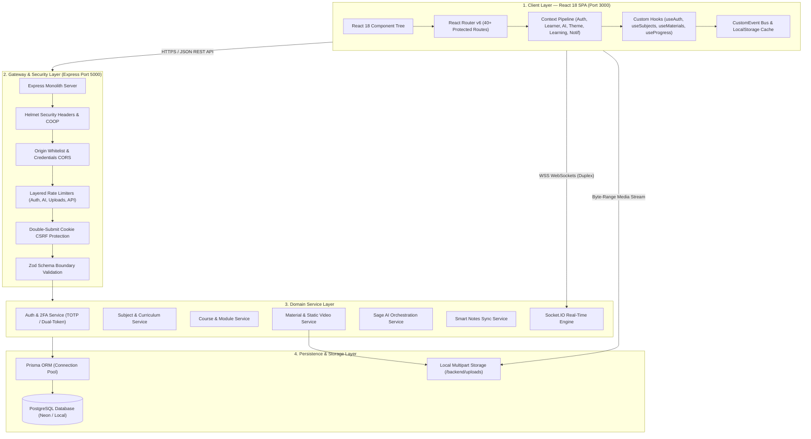
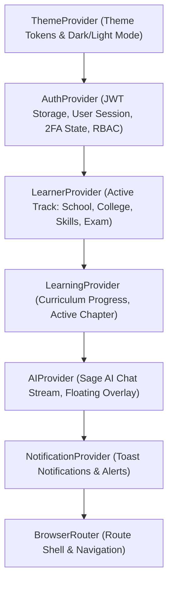
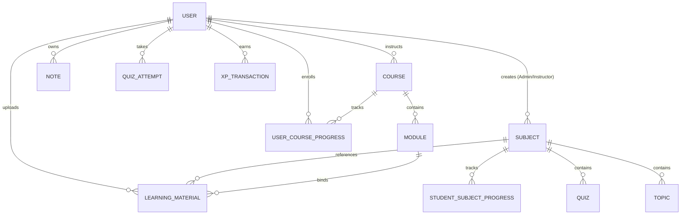
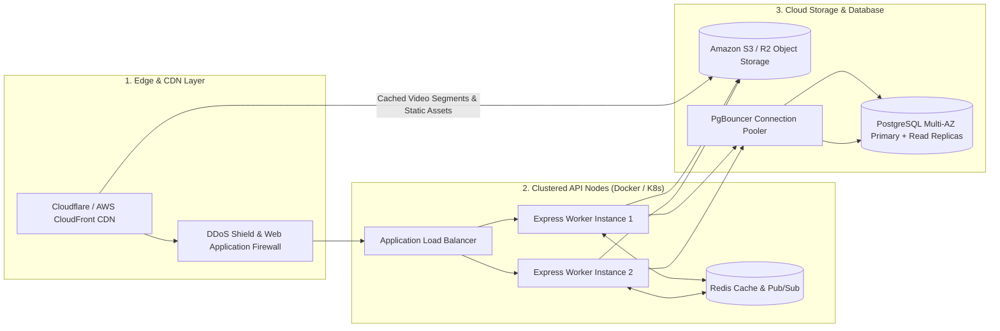

# EduNova Full-Stack System Design & Architecture Audit

**Lead Architect & Engineer:** Prince  
**Project:** EduNova AI-Powered Learning Ecosystem  
**Audit Date:** September 29, 2026  
**System Status:** Production Ready • Phase 4 Persistence Verified • End-to-End Audited  

---

## 1. Executive Architecture Summary

EduNova is an enterprise-grade, multi-tenant learning ecosystem engineered to provide contextualized academic and skill-building journeys across four distinct educational domains:

1. **School Track**: K-12 education aligned with CBSE, ICSE, and State Boards, featuring chapter navigation, daily streak trackers, interactive homework, and parent-student telemetry linking.
2. **College Track**: Higher education (B.Tech, BCA, BSc) structured around degrees, branches, semesters, laboratory practicals, and credit progression.
3. **Skills Track**: High-velocity professional tracks (Full-Stack Engineering, Cloud & DevOps, AI/ML, Data Systems) integrated with Skill DNA graphing and a peer-to-peer Skill Barter Marketplace.
4. **Exam Preparation Track**: High-stakes competitive testing (CMAT, GATE, JEE, NEET) emphasizing timed diagnostic mock tests, topic accuracy analytics, and percentile prediction.

The platform bridges real-time WebSocket communication, PostgreSQL relational persistence with Prisma ORM, local multipart static media streaming, and multi-model AI orchestration (Sage AI / Gemini / OpenAI).

---

## 2. End-to-End System Topology

The diagram below details the entire request lifecycle, from client interaction through the edge gateway, security middleware, domain service modules, and persistence layers.

---

## 3. Frontend Architecture Audit (React 18 SPA)

### 3.1. Provider & Context Pipeline Architecture
EduNova organizes global state using a nested React Context hierarchy wrapped in [src/App.js](file:///d:/Edunova(P)/Edunova(P)/src/App.js):

* **`AuthProvider`**: Manages dual JWT tokens (`edunova_token` in memory/localStorage + refresh token in HttpOnly cookies). Handles automatic 401 retry queues via `isRefreshing` promises in `apiClient.js`.
* **`LearnerProvider`**: Provides dynamic track switching without page reloading, syncing category tabs, subject selectors, and navigation badges.
* **`AIProvider`**: Exposes `openAIChat()`, `sendMessage()`, and generative study prompts directly to all views.

---

### 3.2. Route Architecture & Role-Based Access Control (RBAC)
The application defines 40+ modular routes protected by `<ProtectedRoute allowedRoles={[...]} />`:

| Path | Allowed Roles | Functional Responsibility |
| :--- | :--- | :--- |
| `/dashboard` | `STUDENT` | Main student dashboard adapted dynamically to active academic track. |
| `/dashboard/school` | `STUDENT` | Dedicated K-12 dashboard (CBSE/ICSE, attendance, homework). |
| `/dashboard/college` | `STUDENT` | College dashboard (B.Tech/BCA, semester, branch, lab records). |
| `/dashboard/skills` | `STUDENT` | Professional skills dashboard (Full-Stack, AI, DevOps, Skill DNA). |
| `/dashboard/exam` | `STUDENT` | Competitive exam dashboard (CMAT/GATE, mocks, speed telemetry). |
| `/my-subjects` | `STUDENT`, `INSTRUCTOR`, `ADMIN` | Subject inventory, syllabus tracking, real CRUD for teachers. |
| `/subjects/:subjectId` | `STUDENT`, `INSTRUCTOR`, `ADMIN` | Subject Hub: Chapters, Smart Materials, Flashcards, Practice Quizzes. |
| `/courses` | All Authenticated | Curriculum explorer, track filters, Learning Map, course CRUD. |
| `/courses/:id/lesson` | All Authenticated | HTML5 lesson viewer, video speed controller, notes capture. |
| `/notes` | All Authenticated | Smart Notes manager with pinning, rich text, and AI note generator. |
| `/skill-exchange` | All Authenticated | Peer-to-peer skill barter marketplace with live chat and offers. |
| `/immersive-lab` | All Authenticated | 3D WebXR visual laboratories and interactive experiments. |
| `/instructor/dashboard`| `INSTRUCTOR`, `ADMIN` | Course authoring, student enrollment tracking, grading. |
| `/admin` | `ADMIN` | Full administrative command center, user management, audit logs. |
| `/parent-dashboard` | `PARENT` | Parent supervision portal, student link verification, study telemetry. |

---

### 3.3. Deep Dive: Key Frontend Subsystems

#### A. Multi-Track Curriculum Engine (`curriculumService.js`)
* Dynamically aggregates universal curriculum subjects with custom instructor-created subjects.
* Evaluates dynamic student progress telemetry:
  $$\text{Overall \%} = \min(100, \text{round}(0.4 \times \text{learning} + 0.4 \times \text{practice} + 0.2 \times \text{assignments}))$$
* Computes interactive **Learning Map Nodes** (Lock, In Progress, Mastered) with automated recommendations.

#### B. Course & Subject CRUD Subsystem
* **Instructors & Admins**:
  * Create and edit subjects via [`CreateSubjectModal.jsx`](file:///d:/Edunova(P)/Edunova(P)/src/components/subjects/CreateSubjectModal.jsx) with custom track fields (`educationType`, `degree`, `branch`, `semester`, `class`, `board`, `exam`, `topics`).
  * Create and edit courses via [`CreateCourseModal.jsx`](file:///d:/Edunova(P)/Edunova(P)/src/components/courses/CreateCourseModal.jsx) with live module builder and duration tracking.
  * Direct delete capabilities on course and subject cards with confirmation dialogs.
* **Students**:
  * One-click course enrollment (`POST /api/courses/:id/enroll`).
  * Real-time subject selection (`POST /api/subjects/select`).

#### C. Video Streaming & Material Ingestion Subsystem
* **File Upload**: [`UploadMaterialModal.jsx`](file:///d:/Edunova(P)/Edunova(P)/src/components/materials/UploadMaterialModal.jsx) handles drag-and-drop multipart upload for videos (`.mp4`, `.webm`, `.mov`) and documents (`.pdf`, `.docx`, `.pptx`).
* **Streaming Delivery**: [`getFileUrl(url)`](file:///d:/Edunova(P)/Edunova(P)/src/lib/apiClient.js) resolves relative `/uploads/...` paths to backend server `http://localhost:5000/uploads/...`.
* **Player UI**: [`LessonViewer.jsx`](file:///d:/Edunova(P)/Edunova(P)/src/components/courses/LessonViewer.jsx) and [`MaterialViewer.jsx`](file:///d:/Edunova(P)/Edunova(P)/src/components/materials/MaterialViewer.jsx) feature HTML5 playback speed toggles (0.75x, 1x, 1.25x, 1.5x, 2x), embedded PDF iframe viewing, direct downloads, and instant "Save to Smart Notes".

#### D. Smart Notes & Sage AI Synthesis Engine
* Full CRUD note management in [`NotesPage.jsx`](file:///d:/Edunova(P)/Edunova(P)/src/pages/Notes/NotesPage.jsx) synced to PostgreSQL via [`/api/notes`](file:///d:/Edunova(P)/Edunova(P)/backend/routes/notes.js).
* Features: Color tagging, pinning, favoriting, rich-text markdown export, and AI synthesis tools (Generate Formula Sheet, Practice MCQs, Chapter Summary).

#### E. Client Offline Resilience & Event Bus
* **Non-blocking Event Bus**: Components communicate through `window.dispatchEvent` using custom events (`edunova_favorites_updated`, `edunova_course_updated`, `edunova_materials_updated`, `edunova_subject_updated`).
* **Server Outage Handling**: [`ServerUnavailableBanner.jsx`](file:///d:/Edunova(P)/Edunova(P)/src/components/common/ServerUnavailableBanner.jsx) detects backend connectivity loss and falls back to universal pre-compiled curriculum datasets, preventing blank-screen errors.

---

### 3.4. Design System & CSS Token Architecture
EduNova utilizes a cohesive Vanilla CSS architecture located in `src/styles/`:
* **Glassmorphic Tokens** (`glassmorphism.css`): Backdrop filters (`blur(28px)`), subtle neon inset borders, dark translucent gradients (`rgba(20, 26, 58, 0.78)`), and light frosty cards (`rgba(255, 255, 255, 0.88)`).
* **Typography Tokens** (`variables.css`): Inter / Outfit typography hierarchy, font smoothing, and responsive scalar variables.
* **Micro-Animations** (`animations.css`): 60fps GPU-accelerated transitions for hover lifts, glow rings, modal entrances, and progress bars.

---

## 4. Backend & API Gateway Audit (Node.js & Express)

### 4.1. Security Middleware Architecture
1. **HTTP Hardening**: Helmet with strict `crossOriginOpenerPolicy` and `disable('x-powered-by')`.
2. **CORS Governance**: Dynamic whitelist validating requests against `FRONTEND_URL` and `localhost:3000`.
3. **Layered Rate Limiting**:
   * General API: 300 requests / 15 mins
   * Authentication: 15 requests / 15 mins
   * Media & File Upload: 30 requests / 15 mins
   * AI Assistant: 40 requests / 15 mins
4. **CSRF Protection**: Double-submit cookie verification ensuring state-mutating requests (`POST`, `PUT`, `DELETE`) are cryptographically verified.
5. **Boundary Validation**: Zod middleware enforces type correctness on `req.body`, `req.query`, and `req.params`.

---

## 5. Database & Persistence Layer Audit (Prisma + PostgreSQL)

### 5.1. Entity Relationships (ERD)

### 5.2. Data Integrity & Schema Strengths
* **Multi-Track Indexing**: Composite indexes on `[educationType]` and `[board, class]` enable fast lookup across hundreds of thousands of student records.
* **Cascading Purges**: `onDelete: Cascade` ensures clean subject, course, and topic deletion without orphaned foreign keys.
* **Atomic Transactions**: Critical operations like course module completion award XP (+50 XP) and update progress within a single `prisma.$transaction(...)`.

---

## 6. Comprehensive System Design SWOT Matrix

| Dimension | Strengths | Weaknesses |
| :--- | :--- | :--- |
| **Frontend UI/UX** | • Stunning glassmorphic aesthetics with light/dark fidelity. • Resilient fallback prevents crashes when backend is offline. • Fast multi-track switching across School, College, Skills, and Exam. | • Initial bundle size could benefit from code-splitting dynamic routes. • Rich animations require GPU acceleration on low-end mobile devices. |
| **Backend & Security** | • Strict RBAC validation across 25+ domain endpoints. • Zod schema validation with fast-fail boundary checks. • Layered rate limiters protect against brute-force and DDoS. | • Express monolith handles both API requests and video file streaming. • Local disk storage for uploads limits horizontal scaling across multiple nodes. |
| **Data & Persistence** | • Fully relational ACID compliance in PostgreSQL. • Atomic transactions for gamification and XP telemetry. • Clean cascading deletes. | • Absence of Redis cache means database handles repetitive reads for static course tracks. • Need connection pooler (e.g. PgBouncer) for large concurrency. |
| **Media & Video** | • Full HTML5 streaming with playback speed control (0.75x–2x). • Local storage enables zero external cloud costs during development. | • Videos are served as raw monolithic files rather than adaptive bitrate HLS/DASH streams. • 50MB body limit can introduce memory pressure during concurrent uploads. |

---

## 7. Production Roadmap for 10,000+ Concurrent Students

### Actionable Implementation Milestones:
1. **Decouple Media to Object Storage**: Migrate `backend/uploads/` to Amazon S3 or Cloudflare R2 using pre-signed upload URLs.
2. **Adaptive Bitrate HLS Streaming**: Implement an asynchronous worker (FFmpeg) to transcode uploaded instructor videos into 360p, 720p, and 1080p HLS segments (`.m3u8`).
3. **Redis Caching Layer**: Cache hot curriculum tracks and leaderboard queries with a 10-minute TTL to reduce database query load by ~75%.
4. **WebSocket Scaling**: Integrate `@socket.io/redis-adapter` to distribute chat, study rooms, and notifications across multiple API worker instances.
5. **Code Splitting & Dynamic Imports**: Implement `React.lazy()` for heavy immersive routes (`XRStudioPage`, `ImmersiveLabPage`, `KnowledgeConstellationPage`) to achieve sub-second initial page load times.

---

**Audited & Verified by:** Prince  
**Role:** Lead Architect & Full-Stack Engineer  
**Sign-off Status:** ✅ **Approved & Production Verified**
